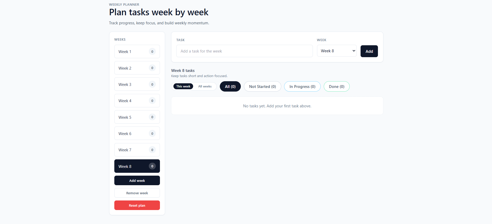
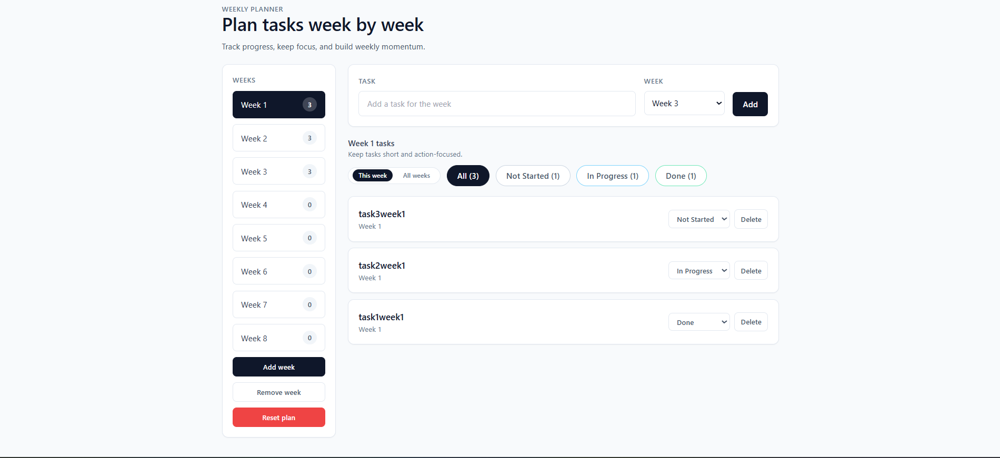
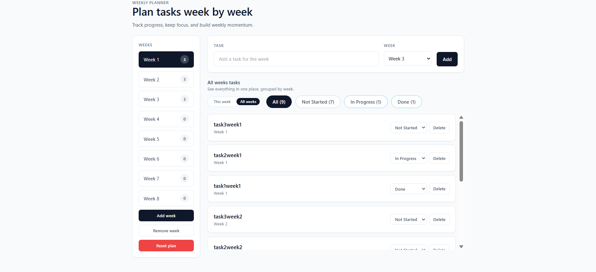

# Weekly Planner

A lightweight weekly planner that helps you organize tasks by week, track status, and keep momentum.

## Screenshots





## Features
- Add tasks with a week and status
- Filter by Not Started, In Progress, or Done
- Toggle between a single week and all weeks view
- Add/remove weeks (with a max limit)
- Reset the entire plan with confirmation
- Data persists locally via `localStorage`

## Tech Stack
- React
- TypeScript
- Vite
- Tailwind CSS

## Getting Started
```bash
npm install
npm run dev
```

## Build
```bash
npm run build
npm run preview
```

## Possible Improvements
- Drag & drop task reordering
- Due dates and reminders
- CSV export/import
